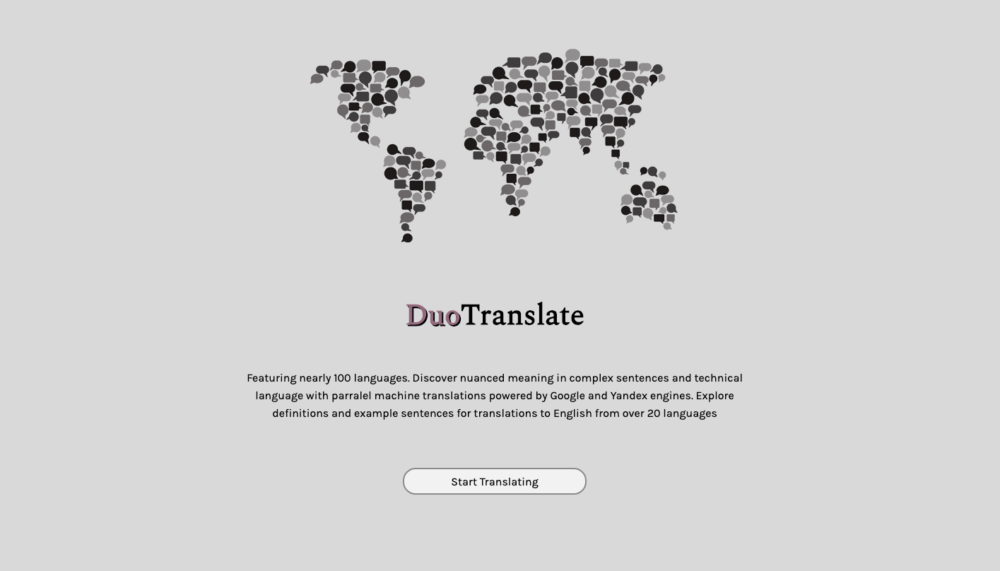
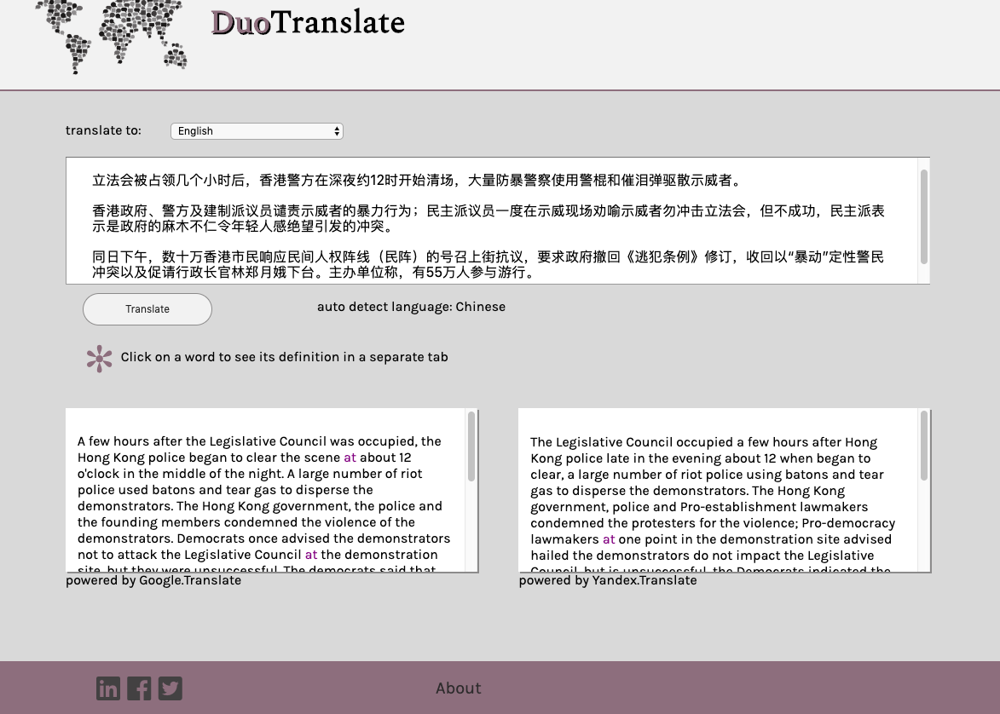
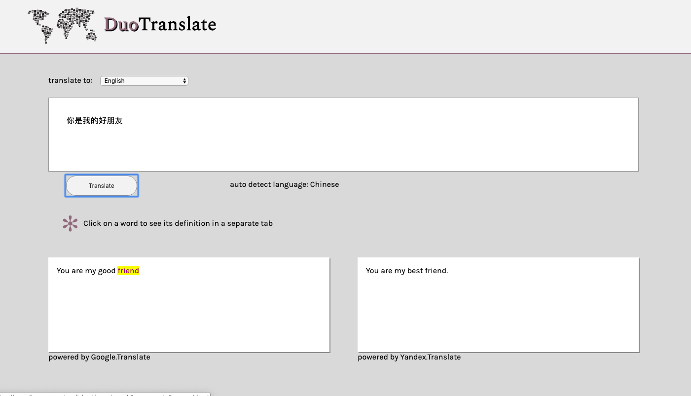

DuoTranslate 

Link to app: https://dbravo7.github.io/translation_app/

technology: html, css, javascript, jquery

Summary: 
A translation app that makes calls to two APIs: google translate and Yandex translate. Translations for nearly 100 languages are presented simultaneously allowing for easy comparison. For over 20 languages translated to English, words are linked to the website linguee.com for definitions and example sentences.

